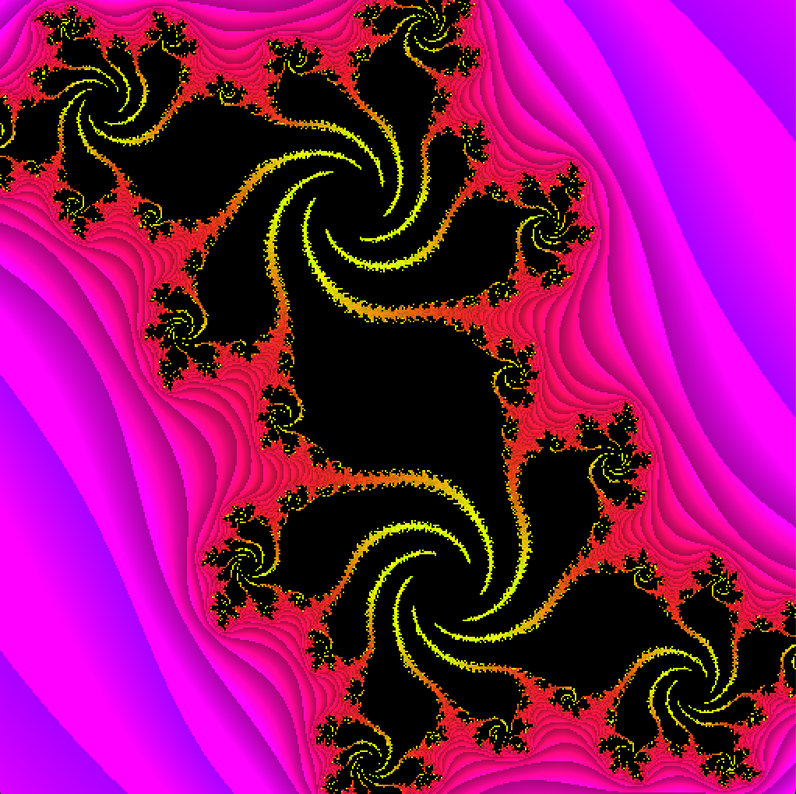

# opengl-crash-course



## Introduction
A C/C++ project repository using OpenGL which is created on the purpose of preparing for **[CS380: Introduction to Computer Graphics]** course held at KAIST in spring 2021. This project is built on C++17 and can be compiled using g++, clang++, and MSVC. Currently, this project supports Windows and macOS only (I haven't tested the codes on Linux and other UNIX-family systems yet).

## Dependencies
**I'll write a detailed post regarding installing & running the project soon.**
### Windows
- **OpenGL**
- **GLEW** 
- **GLUT (freeGLUT is also fine)**

### macOS
The most straightforward way is to use the implementation from Apple.
- **OpenGL**
- **GLUT**

Here are the links that I used to get libraries.
- [GLEW](http://glew.sourceforge.net)
- [GLUT (for Windows MSVC)](https://www.transmissionzero.co.uk/software/freeglut-devel/)

### Linux
**Not tested yet**

## Project Structure
```
.
├── includes                # Header files
├── media                   # Typically images generated using OpenGL
├── src                     # Source files
├── .gitignore              # .gitignore file
├── CMakeLists.txt          # CMakeLists.txt file containing project settings & build options                   
└── README.md               # The file you are reading
```
